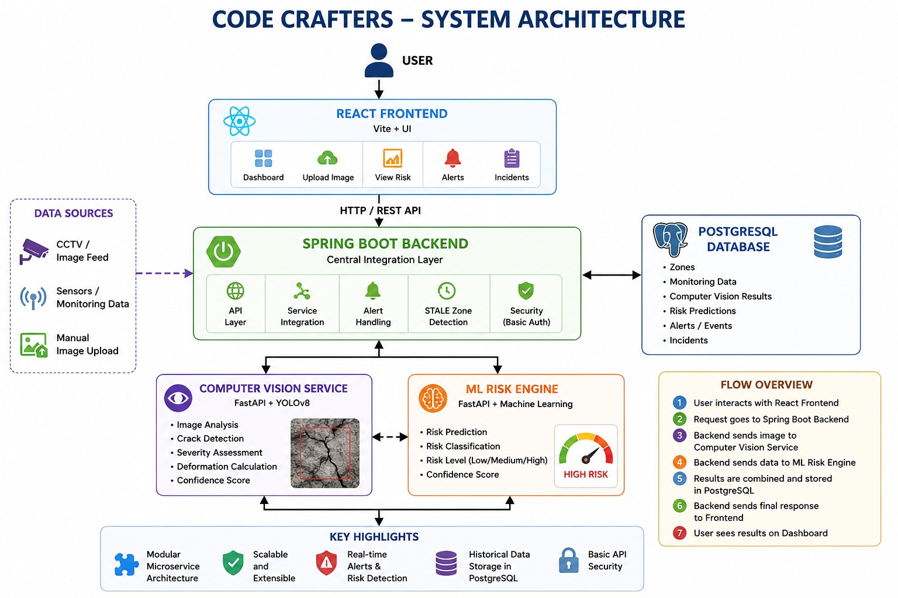
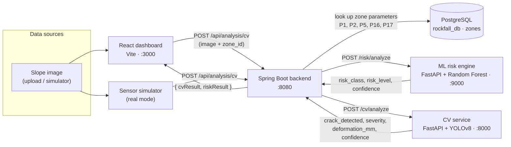

# Code Crafters — AI-Based Rockfall Prediction & Alert System

**Detecting slope cracks with computer vision and predicting rockfall risk with machine learning, so open-pit mine operators get warned before a slope fails.**


> Built by **Team Code Crafters** for **Smart India Hackathon 2026**.
> Problem statement: *AI-Based Rockfall Prediction and Alert System for Open-Pit Mines*. Theme: Disaster Management. Category: Software.

---

## Table of Contents

1. [Overview](#overview)
2. [Key Features](#key-features)
3. [System Architecture](#system-architecture)
4. [Tech Stack](#tech-stack)
5. [Project Structure](#project-structure)
6. [Installation and Setup](#installation-and-setup)
7. [Usage](#usage)
8. [Model and Prediction Approach](#model-and-prediction-approach)
9. [Results and Screenshots](#results-and-screenshots)
10. [Future Scope](#future-scope)
11. [Team](#team)

---

## Overview

### The problem

Rockfalls and slope failures are a serious hazard in open-pit mines. Recent incidents in Andhra Pradesh and Telangana show what is at stake:

- **Granite quarry, Bapatla (2025):** a rock face collapsed after heavy rainfall, killing 6 workers and injuring 10.
- **SCCL open-cast mine, Ramagiri (2024):** a sidewall collapsed in a pit affected by rainwater, burying 2 workers and injuring 2 more.

Existing safety measures are often not enough:

- Slope instability can develop before anything collapses visibly.
- Rainfall, blasting, vibration and cracking can speed up slope failure.
- Manual inspections can't watch every mining zone all the time.
- A small crack or deformation today can become a major rockfall tomorrow.
- Missing sensor data can itself mean that monitoring has failed.

### Our approach

Code Crafters adds **AI-based early warning** on top of manual inspection:

- A **computer-vision service** (YOLOv8 segmentation) analyses slope images. It detects cracks, grades their severity and estimates displacement against a reference image for each zone.
- An **ML risk engine** (Random Forest) classifies each zone's slope condition as *Stable*, *Inter-ramp failure* or *Overall failure*, with a confidence score.
- A **Spring Boot backend** sits between the services. It looks up zone parameters in PostgreSQL, calls the CV and ML services, and returns one combined result.
- A **React control-room dashboard** shows every zone on a map. It has live condition panels, trend charts, a crack-inspection tool, an incident log and a high-risk alert banner with an audible siren.

---

## Key Features

**Implemented in this repository**

- 🔍 **Crack detection and segmentation.** A trained YOLOv8 segmentation model (`computer-vision/models/crack-seg-best.pt`) returns the crack confidence, bounding boxes and mask polygons.
- 📏 **Crack severity grading** (`NONE` / `LOW` / `MEDIUM` / `HIGH`), based on detection confidence and how much of the image the crack covers.
- 📐 **Deformation estimate for each zone.** The service compares crack positions with the first image it saw for that zone and converts the shift from pixels to millimetres.
- 🧠 **ML risk classification.** A Random Forest classifier predicts *Stable*, *Inter-ramp failure* or *Overall failure* from five slope parameters stored for each zone.
- 🔗 **Combined analysis API.** One backend call (`POST /api/analysis/cv`) returns both the CV result and the ML risk result.
- 🗺️ **Map of the mine.** A Leaflet map shows satellite, dark and topographic layers, colour-coded zone markers and polygon outlines for four pit-wall sectors.
- 🚨 **High-risk alert banner** with a siren generated by the Web Audio API, plus mute and acknowledge controls.
- 📈 **Live charts** of deformation, risk score, vibration and rainfall (Recharts).
- 📷 **Crack-inspection tool** in the dashboard. You can upload an image and send it to the backend for analysis.
- 📋 **Incident history** with list and detail pages.
- ⏱️ **Two-reading alert check (hysteresis)** and **STALE-zone detection.** A HIGH alert fires only after two high readings in a row, and zones whose data has stopped updating are flagged. *Both currently run in the dashboard's demo mode and the simulator's mock server.*
- 🧪 **Sensor and scenario simulator** with a real mode (sends images to the backend) and a mock mode (four-stage SAFE → WARNING → CRITICAL → ROCKFALL demo).
- ✅ **Tests.** pytest suites for the CV service, a Postman/Newman collection for the APIs, and a Spring Boot smoke test.

---

## System Architecture



### Data flow (as implemented)



**Step by step:**

1. An operator uploads a slope image for a zone (e.g. `SLOPE_A`) from the dashboard's crack-inspection tool, or the simulator sends one.
2. The **backend** (`AnalysisService`) loads that zone's stored slope parameters from the PostgreSQL `zones` table.
3. The backend sends the parameters to the **ML risk engine**, which returns a risk class, a label and a confidence score.
4. The backend sends the image to the **CV service**, which returns the crack detection, severity and deformation results.
5. The backend combines both results into one response for the dashboard.

`GET /api/analysis/risk/{zoneId}` runs only step 3, giving a risk check for a zone without an image.

> **Integration status:** the dashboard also calls `GET /api/zones`, `GET /api/current-risk` and `GET /api/incidents`. The backend does not implement these endpoints yet, so when they fail the dashboard falls back to its built-in demo data (`frontend/src/constants/zones.js`). The simulator's mock server (`sensor-simulator/src/mock_server.py`) provides similar endpoints for standalone testing.

---

## Tech Stack

| Layer | Technologies |
|---|---|
| **Frontend** | React 18, Vite 6, Tailwind CSS 3, React Router 7, Leaflet + React-Leaflet, Recharts, Axios, Lucide icons, Web Audio API |
| **Backend** | Java 17, Spring Boot 4.1 (Web MVC, Data JPA, Validation), `RestClient`, Lombok, Maven Wrapper |
| **Database** | PostgreSQL (Hibernate `ddl-auto=update`) |
| **Computer vision** | Python, FastAPI, Uvicorn, Ultralytics YOLOv8 (segmentation), OpenCV, Pillow, NumPy |
| **ML risk engine** | Python, FastAPI, Uvicorn, scikit-learn 1.6.1 (`RandomForestClassifier`), pandas, NumPy, joblib |
| **Simulation and testing** | Python (FastAPI, Pydantic, httpx), pytest, Postman / Newman, JUnit (Spring Boot Test) |
| **Collaboration** | Git and GitHub: a branch per module, protected `main`, PR reviews |

---

## Project Structure

```text
code-crafters/
├── backend/                          # Spring Boot integration layer (port 8080)
│   ├── pom.xml                       # Maven build: Spring Boot 4.1, Java 17, PostgreSQL, JPA
│   ├── mvnw / mvnw.cmd               # Maven wrapper (no global Maven install needed)
│   └── src/main/
│       ├── java/com/codecrafters/backend/
│       │   ├── BackendApplication.java        # Spring Boot entry point
│       │   ├── controller/AnalysisController.java  # /api/analysis/cv and /api/analysis/risk/{zoneId}
│       │   ├── service/AnalysisService.java   # Loads the zone, calls the ML and CV services, merges results
│       │   ├── client/CvClient.java           # REST client → CV service /cv/analyze
│       │   ├── client/RiskEngineClient.java   # REST client → ML engine /risk/analyze
│       │   ├── entity/Zone.java               # JPA entity: zone_id + slope parameters P1, P2, P5, P16, P17
│       │   ├── repository/ZoneRepository.java # findByZoneId lookup
│       │   ├── dto/                           # Request/response objects for the CV, ML and combined results
│       │   └── config/RestClientConfig.java   # RestClient.Builder bean
│       └── resources/application.properties   # DB connection + CV/ML service URLs
│
├── computer-vision/                  # Crack detection service (port 8000)
│   ├── app.py                        # FastAPI app: /health, /cv/analyze, reference images per zone
│   ├── inference.py                  # Loads YOLOv8, runs inference, extracts boxes/masks
│   ├── severity.py                   # NONE/LOW/MEDIUM/HIGH severity rules
│   ├── deformation.py                # Crack-centre displacement → millimetres
│   ├── models/crack-seg-best.pt      # Trained YOLOv8 segmentation weights
│   ├── tests/                        # pytest suites for the API and inference
│   └── requirements.txt
│
├── ml-model/                         # Rockfall risk engine (port 9000)
│   ├── main.py                       # FastAPI app: /health, /risk/analyze
│   ├── predict.py                    # Loads the model, returns class, label and confidence
│   ├── risk_model.pkl                # Trained RandomForestClassifier
│   ├── model_info.pkl                # Feature order + class labels
│   └── requirements.txt
│
├── frontend/                         # React control-room dashboard (port 3000)
│   ├── vite.config.js                # Dev server on :3000, proxies /api → :8080
│   ├── src/App.jsx                   # Routes, polling, alert and demo-mode state
│   ├── src/pages/                    # Dashboard, ZoneDetails, IncidentsList, IncidentDetails
│   ├── src/components/               # MineMap, TelemetryCharts, AlertBanner, CameraInspectorModal, DemoController, …
│   ├── src/services/api.js           # Backend calls, with fallback to built-in demo data
│   ├── src/services/audio.js         # Web Audio siren and beeps
│   └── src/constants/zones.js        # Zone locations and outlines + 4-stage demo scenarios
│
├── sensor-simulator/                 # Scenario driver and test tooling
│   ├── main.py                       # CLI entry point (--mode real | mock)
│   ├── src/real_runner.py            # Real mode: sends test images to the backend
│   ├── src/mock_server.py            # Standalone mock backend (port 8001), not used in production
│   ├── src/data_generator.py         # Generates mock sensor readings
│   ├── scenarios/runner.py           # Runs SAFE → WARNING → CRITICAL → ROCKFALL stages
│   ├── config/                       # Settings (environment variables) + scenario definitions
│   ├── postman/                      # Postman collection + environment
│   ├── test-images/                  # Put safe/warning/critical sample images here
│   ├── run_demo.sh / run_demo.bat    # Mock demo launchers
│   └── .env.example
│
├── docs/                             # Planning material (SIH idea deck, team setup, architecture diagram)
└── .github/PULL_REQUEST_TEMPLATE.md
```

---

## Installation and Setup

### Prerequisites

| Tool | Version | Used by |
|---|---|---|
| Java JDK | 17+ | backend |
| PostgreSQL | any recent version | backend |
| Python | 3.10+ | computer-vision, ml-model, sensor-simulator |
| Node.js + npm | 18+ | frontend |

### 1. Clone the repository

```bash
git clone https://github.com/rishi555123/code-crafters.git
cd code-crafters
```

### 2. Set up the database

Create the database the backend expects:

```bash
psql -U postgres -c "CREATE DATABASE rockfall_db;"
```

Then set your own PostgreSQL username and password in `backend/src/main/resources/application.properties` (`spring.datasource.username` / `spring.datasource.password`).

Hibernate creates the `zones` table when the backend first starts (`ddl-auto=update`). **The backend needs at least one zone row before analysis works.** If the zone is missing, it returns a `Zone not found` error. Example:

```sql
-- Example values only. Each parameter must be between 0 and 1 (checked by the ML engine).
INSERT INTO zones (zone_id, p1, p2, p5, p16, p17) VALUES
  ('SLOPE_A', 0.5, 0.5, 0.5, 0.5, 0.5),
  ('SLOPE_B', 0.5, 0.5, 0.5, 0.5, 0.5),
  ('SLOPE_C', 0.5, 0.5, 0.5, 0.5, 0.5);
```

### 3. ML risk engine (port 9000)

```bash
cd ml-model
python -m venv .venv
.venv\Scripts\activate          # Windows
# source .venv/bin/activate     # macOS / Linux
pip install -r requirements.txt
uvicorn main:app --port 9000
```

> Run it from inside `ml-model/`, because the model is loaded from the relative path `risk_model.pkl`. Keep `scikit-learn==1.6.1` so the saved model loads without version warnings.

### 4. Computer-vision service (port 8000)

```bash
cd computer-vision
python -m venv .venv
.venv\Scripts\activate          # Windows
# source .venv/bin/activate     # macOS / Linux
pip install -r requirements.txt
uvicorn app:app --reload --port 8000
```

> Run it from inside `computer-vision/`, because the weights are loaded from `models/crack-seg-best.pt`.

### 5. Backend (port 8080)

```bash
cd backend
mvnw.cmd spring-boot:run        # Windows
# ./mvnw spring-boot:run        # macOS / Linux
```

The CV and ML service URLs are set in `application.properties`:

```properties
cv.service.base-url=http://localhost:8000
risk-engine.service.base-url=http://127.0.0.1:9000
```

### 6. Frontend (port 3000)

```bash
cd frontend
npm install
npm run dev
```

Open <http://localhost:3000>. The Vite dev server forwards `/api/*` requests to `http://localhost:8080`.

### 7. Sensor simulator (optional)

```bash
cd sensor-simulator
pip install -r requirements.txt
cp .env.example .env            # adjust URLs if needed
```

---

## Usage

### Check that the services are running

```bash
curl http://127.0.0.1:8000/health    # CV  → {"status":"ok"}
curl http://127.0.0.1:9000/health    # ML  → {"status":"healthy"}
```

Or let the simulator check all three:

```bash
python main.py --mode real --check
```

### Full analysis through the backend

```bash
curl -X POST http://localhost:8080/api/analysis/cv \
  -F "image=@slope.jpg" \
  -F "zone_id=SLOPE_A"
```

Example response:

```json
{
  "cvResult": {
    "zone_id": "SLOPE_A",
    "timestamp": "2026-08-22T11:20:30.723844+00:00",
    "crack_detected": true,
    "crack_severity": "HIGH",
    "deformation_mm": 0.0,
    "crack_confidence": 0.8777
  },
  "riskResult": {
    "risk_class": 1,
    "risk_level": "Inter-ramp failure",
    "confidence": 0.94
  }
}
```

Risk only for a zone (no image):

```bash
curl http://localhost:8080/api/analysis/risk/SLOPE_A
```

### Call the services directly

**CV service:** interactive docs at <http://127.0.0.1:8000/docs>

```bash
curl -X POST http://127.0.0.1:8000/cv/analyze \
  -F "image=@test.png;type=image/png" \
  -F "zone_id=SLOPE_A"
```

The first image for a zone becomes its **reference**, so its `deformation_mm` is `0.0`. Later images for the same zone are compared against that reference. An upload that isn't a valid image returns `400 Uploaded file is not a valid image`.

**ML risk engine:** interactive docs at <http://127.0.0.1:9000/docs>

```bash
curl -X POST http://127.0.0.1:9000/risk/analyze \
  -H "Content-Type: application/json" \
  -d '{"P16": 0.4, "P5": 0.6, "P17": 0.3, "P2": 0.5, "P1": 0.7}'
```

```json
{ "risk_class": 0, "risk_level": "Stable", "confidence": 0.82 }
```

*(The response values above show the format only. The actual output depends on the input.)*

### Dashboard

- **Dashboard (`/`):** map of the mine, zone stats, live charts and recent incidents.
- **Zone details (`/zone/:zoneId`):** conditions and trends for one zone.
- **Incidents (`/incidents`, `/incident/:id`):** incident log and details for each event.
- **Camera inspector:** upload a slope image and send it to `POST /api/analysis/cv`.
- **Demo controller:** steps a zone through the four demo stages and lets you mark a zone as STALE.

### Simulator

**Real mode:** sends images from `sensor-simulator/test-images/<scenario>/` to the backend. Add your own sample images first; the repo doesn't include any.

```bash
python main.py --mode real --scenario safe       # also: warning, critical
python main.py --mode real --demo                # safe → warning → critical
```

**Mock mode:** a standalone demo that doesn't need the real services.

```bash
# Terminal 1
python -m src.mock_server                        # mock backend on :8001

# Terminal 2
python main.py                                   # SAFE → WARNING → CRITICAL → ROCKFALL
python main.py --stage critical                  # a single stage
python main.py --status | --incidents | --zones
```

Sample mock-mode output:

```text
STAGE: 3 — CRITICAL
>>> Critical reading 1/2 <<<
RISK [SLOPE_A]: HIGH (score=72.5, consecutive=1, alert=False)
>>> Critical reading 2/2 <<<
RISK [SLOPE_A]: HIGH (score=74.0, consecutive=2, alert=True)
INCIDENT #1: ALERT_TRIGGERED in SLOPE_A (risk=HIGH, score=74.0)
```

### Tests

```bash
cd computer-vision && pytest -q                  # CV inference + API tests
cd backend && mvnw.cmd test                      # Spring context smoke test
newman run sensor-simulator/postman/rockfall-api-collection.json \
  -e sensor-simulator/postman/rockfall-api-environment.json
```

---

## Model and Prediction Approach

### 1. Crack detection (computer vision)

| Item | Detail |
|---|---|
| Model | YOLOv8 **segmentation** (Ultralytics), single class `crack` |
| Weights | `computer-vision/models/crack-seg-best.pt` |
| Outputs per detection | class, confidence, bounding box `[x1, y1, x2, y2]`, mask polygon |
| Detection threshold | `crack_confidence ≥ 0.25` → `crack_detected = true` |

**Severity rules** (`severity.py`), applied to cracks with confidence ≥ 0.25:

| Severity | Condition |
|---|---|
| `HIGH` | confidence ≥ 0.80 **or** largest crack box covers ≥ 10% of the image |
| `MEDIUM` | confidence ≥ 0.50 **or** largest crack box covers ≥ 3% of the image |
| `LOW` | crack detected, but neither condition above is met |
| `NONE` | no crack at or above the threshold |

**Deformation estimate** (`deformation.py`):

1. The first set of detections for a zone is stored as that zone's reference. It is kept in memory and cleared when the service restarts.
2. For each crack in a new image, the service finds the nearest reference crack and measures the distance between their box centres.
3. It takes the largest of those distances and converts it with `PIXELS_PER_MM = 10.0`, giving `deformation_mm = pixels / 10`, rounded to 2 decimal places.

**Training:** the planning deck says the team used publicly available crack-detection datasets (the METU Concrete Crack Images dataset is cited) and adapted the pipeline to rock surfaces, because real slope-crack images are scarce.

### 2. Rockfall risk classification (ML)

| Item | Detail |
|---|---|
| Algorithm | `RandomForestClassifier` (scikit-learn 1.6.1) |
| Hyperparameters | `n_estimators=300`, `max_depth=5`, `min_samples_leaf=2`, `class_weight="balanced"`, `random_state=42` |
| Input features (in order) | `P16`, `P5`, `P17`, `P2`, `P1`, each between 0 and 1 |
| Output classes | `0` Stable · `1` Inter-ramp failure · `2` Overall failure |
| Confidence | highest class probability from `predict_proba` |

These values come from `ml-model/risk_model.pkl` and `ml-model/model_info.pkl`. The backend stores each zone's five parameters in the `zones` table and sends them to the engine for every analysis.

### 3. Alert logic

The planning deck describes two safeguards, and they are implemented in the dashboard's demo mode and the simulator's mock server:

- **Two-reading alert check (hysteresis):** a HIGH-risk alert fires only after **2 HIGH readings in a row**, so a single spike doesn't cause a false alarm.
- **STALE-zone detection:** a zone whose data stops updating is flagged (the dashboard shows a STALE badge), so missing data is never treated as safe.

The mock server's demo risk score (`sensor-simulator/src/mock_server.py`) adds up points for rainfall (up to 30), vibration (up to 25), humidity (up to 10), crack severity (up to 20) and deformation (up to 15). A total of 60 or more is **HIGH**, 30 or more is **MEDIUM**, and anything lower is **LOW**. These are demo calibration values, not geological standards.

---

## Results and Screenshots


Example CV output on a test image (from `computer-vision/README.md`): a crack was detected with confidence **0.878**, graded **HIGH**.

---

## Future Scope

These items are planned or suggested in the planning documents and module READMEs but are not yet built into the integrated system:

- **Complete backend API for the dashboard:** `GET /api/zones`, `GET /api/current-risk` and `GET /api/incidents`, so the dashboard shows live data instead of its built-in demo data.
- **Store results in PostgreSQL:** monitoring data, CV results, risk predictions, alerts and incidents (only `zones` is stored today).
- **Backend alert handling:** server-side two-reading alert check and STALE-zone detection, which today exist only in the frontend and mock server.
- **API security:** Basic Auth on the backend (shown in the architecture diagram).
- **Live sensor input:** rainfall, humidity, temperature and vibration from real field sensors, plus CCTV camera feeds instead of manual uploads.
- **Combine CV, sensor and ML outputs into one dynamic risk score**, as described in the plan.
- **More accurate CV measurements:** stored reference images per zone, camera calibration, image alignment between frames, tracking cracks across frames, and measuring crack length, width and area from the masks.
- **Better models:** more mine- and slope-specific training data (including images with no cracks), data augmentation, and published evaluation metrics.
- **Notifications** (SMS, email or sirens) beyond the dashboard banner.
- **Use stored history** to retrain and improve the risk models over time.

---

## Team

This project was built collaboratively by a team of six 3rd-year students. Each person owned one module branch, and pull requests were reviewed by the team leader.

| Name | Role | Branch | Contact |
|---|---|---|---|
| Srighakollapu R V S S Rishith | Team Leader | CSE | rishi.srighakollapu@gmail.com |
| Thallapally Vashista | Backend (Spring Boot) | CSE | vashistathallapally476@gmail.com |
| Sundari Harshith | Sensor Simulation & Testing | CSE | harshithvarma004@gmail.com |
| Dikshitha Dumala | ML Risk Engine | CSE | dikshithadumala@gmail.com |
| Srijani Varma | Computer Vision | CSM | srijanivarma@gmail.com |
| Vyshnavi Aitha | Frontend (React Dashboard) | CSM | aithavyshnavi337@gmail.com |
